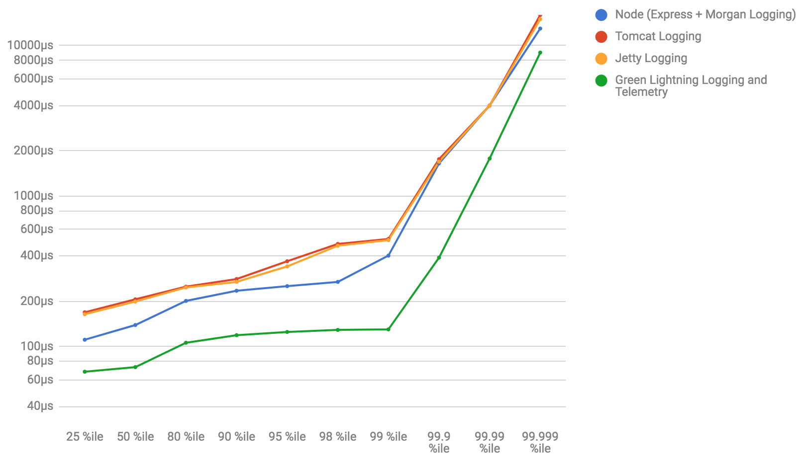

# Green Lightning
Green Lightning is an embeddable high-performance microservice framework with built-in HTTP and MQTT support.

## How is it different?
Green Lightning is built from the ground-up to be garbage-free, lock-free, and security-first. It is capable of running directly on Compact-1 Java Virtual Machines with no additional configuration.

The framework uses a declarative event-driven actor model, making code simpler and easier to maintain. Because of this declarative model, operational logic like thread synchronization, exception handling, and null object conditions are handled by the framework and completely removed from your business logic. This lets users write logic that is multithreaded *and* asynchronous without ever scheduling a single task or creating a single lock.

Green Lightning supports fine-grained telemetry information published via a built-in web server which can be enabled or disabled with a single flag. When enabled, this server allows users to inspect live metrics about class-level CPU utilization and end-to-end data throughput - all without any specialized build or deployment. 

## Performance
Benchmarks for Green Lightning are provided by the [Green Loader](https://github.com/oci-pronghorn/GreenLoader) project. Below is a graph that compares the latency by percentile of Green Lightning and several other web services frameworks with request logging and telemetry enabled.

## Getting Started

Starter Project Instructions:
https://github.com/oci-pronghorn/GreenLighter

Sample Projects:
https://github.com/oci-pronghorn/GreenLightning-API
https://github.com/oci-pronghorn/GreenLightning-Examples

## Contributing

The code on GitHub:
https://github.com/oci-pronghorn/GreenLightning

The build server:
https://pronghorn.ci.cloudbees.com/job/GreenLightning/
